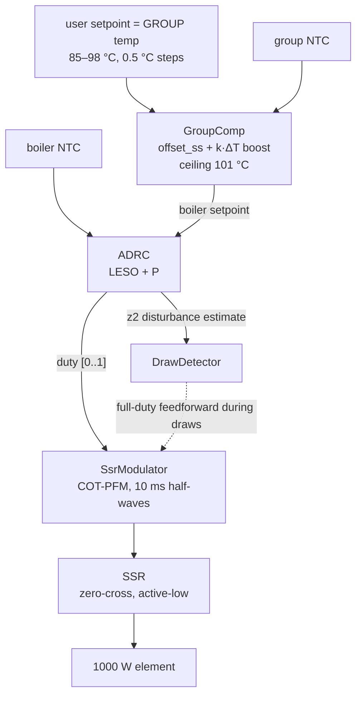

# anita-adrc

**ADRC boiler temperature control for a Lelit Anita (PL042) espresso machine.**

The stock machine regulates its 250 ml brass boiler (1000 W element) with a
bi-metal thermostat — a hysteresis band of several °C right where espresso is
most sensitive. This project replaces the brew thermostat with an ESP32-C3
running **Active Disturbance Rejection Control**: a first-order LADRC whose
extended state observer estimates everything not modelled (heat loss, water
draws, sensor lag) as one live disturbance signal and cancels it every cycle.



## Highlights

- **Two NTC channels**: boiler shell (control) + brew group (the real
  target). The user setpoint refers to *group* temperature; a measured-ΔT
  feedforward raises the boiler to compensate — cold-start boost, warm-up
  flushes and cool-down all fall out of one law, nothing scheduled or timed.
- **Constant on-time PFM** SSR modulation (sigma-delta at the 10 ms
  half-wave): at idle duty it fires isolated single half-waves at a variable
  rate — minimal energy quanta, no burst-window quantization.
- **Draw detection for free**: the observer's disturbance state `z2` steps
  within seconds of water leaving the boiler; duty is fed forward to 100 %
  before the temperature error even develops.
- **Host-native simulation**: the exact controller code runs against a
  three-mass thermal model (`pio run -e native`), with closed-loop regression
  tests asserting overshoot, steady-state band and draw recovery in CI.
- **MQTT + Home Assistant discovery**: temps, duty, disturbance estimate,
  setpoint and live `k_boost` tuning appear automatically as one HA device.
- **Safety first**: the factory safety thermostat stays in series; the SSR
  drive is active-low current-sinking so reset/flash/crash all mean *heater
  off*; latching software faults (overtemp, NTC open/short, no-rise, stale
  ADC) and a task watchdog on top. See [docs/hardware.md](docs/hardware.md).

## Hardware

ESP32-C3 0.42" OLED board (01Space style) · 2× NTC 3950 100 kΩ + 10 kΩ 0.1 %
high-side dividers (GPIO3/4) · zero-crossing SSR on GPIO10 (active-low) ·
single button (GPIO9): short press +0.5 °C, long press −0.5 °C.

Full wiring, BOM and bring-up checklist: [docs/hardware.md](docs/hardware.md).

## Quick start

```bash
# 1. Unit + closed-loop regression tests (no hardware needed)
pio test -e native

# 2. Simulate a full day: cold start → espresso → flush → two big cups
pio run -e native
.pio/build/native/program --scenario full --csv out.csv
pip install -r tools/requirements.txt
python tools/plot_sim.py out.csv

# 3. Firmware
cp src/secrets.h.example src/secrets.h   # fill in WiFi + MQTT
pio run -e esp32c3 -t upload
python tools/plot_serial.py --port /dev/ttyACM0 --log run.csv
```

The simulator CLI takes tuning overrides (`--wc --wo --b0 --pred --kboost`)
and scenarios `cold_start`, `cold_start_noboost`, `espresso`, `maxdraw`,
`flush`, `full`, `ident` — see [docs/adrc.md](docs/adrc.md) for the math and
the tuning procedure.

## Hardware tuning loop

Real-machine tuning runs entirely over the USB cable
([docs/tuning-hardware.md](docs/tuning-hardware.md)): a serial console in the
firmware (`id duty/off`, `mark`, `set`, `get`) drives guarded identification
experiments while `tools/tune_capture.py` records the stream with scenario
markers; `tools/fit_model.py` extracts the machine's real constants (heat
capacity, losses, sensor lag, group coupling) from the capture; the `/retune`
skill applies them to the model and controller defaults, re-verifies the
regression contract in sim, and rebuilds. The capture→fit pipeline is
validated in CI against the simulator's known truth
(`--scenario ident --serial-format`), so the tooling is proven before it
touches the machine.

Before the retrofit, an optional one-time **sensor calibration run**
(`pio run -e esp32c3-observer`) clamps a DS18B20 reference against each NTC
while the stock bimetal still runs the machine; `tools/calibrate.py` fits a
custom Steinhart–Hart curve per NTC from the recorded sweep (details in
[docs/tuning-hardware.md](docs/tuning-hardware.md), step 0).

For a fully guided session, run the **`/tune-wizard`** skill in Claude Code:
it walks you through the whole scenario suite at the machine (cold start,
ident, setpoint step, espresso, flush, big draw), runs the captures as
background tasks, injects scenario markers into the live recording, validates
every capture, and ends with the retune — pausing before anything is flashed.

## Repository layout

```
lib/            pure C++17, no Arduino deps — compiled on host AND device
  adrc/         LADRC + LESO (bandwidth-parameterized, lag-compensated)
  group_comp/   ΔT boost + slow learned boiler↔group offset
  draw_detect/  z2-based draw detection
  ssr_modulator COT-PFM sigma-delta half-wave modulator
  safety/       latching fault monitor
  controller_core/  the full control behavior, hardware-free
  plant_model/  three-mass boiler model + SimHarness (host only)
src/            ESP32-C3 firmware: tasks, ADC, OLED, button, WiFi/MQTT, NVS
sim/            simulator entry point (env:native)
test/           Unity tests incl. the closed-loop tuning contract
tools/          matplotlib plotting for sim CSVs and device serial logs
docs/           ADRC math+tuning · hardware/safety · tuning log
```

Simulated performance with the committed defaults (asserted in CI): cold
start to a ready group in ~6 min with <0.4 °C overshoot, steady state
±0.02 °C, a 30 ml espresso barely dents the group, and a 250 ml/30 s
worst-case draw saturates the element in ~11 s and recovers without windup.

## Status / roadmap

- [x] Controller core, simulator, regression tests (CI)
- [x] Firmware builds for ESP32-C3 (tasked architecture, HA discovery)
- [x] Serial tuning console + capture/fit/retune loop (CI-validated round trip)
- [ ] Bench bring-up: NTC calibration, SSR pulse patterns on LED, flash-cycle
      off-state check
- [ ] Machine integration behind the factory safety thermostat (duty-capped
      first heat-up via `set cap 0.3`)
- [ ] Hardware tuning per docs/tuning-hardware.md: capture → fit → /retune →
      flash — log in docs/tuning-log.md

## License

[MIT](LICENSE). This project switches mains power around pressurized hot
water. You do this at your own risk; read [docs/hardware.md](docs/hardware.md)
before opening the machine.
