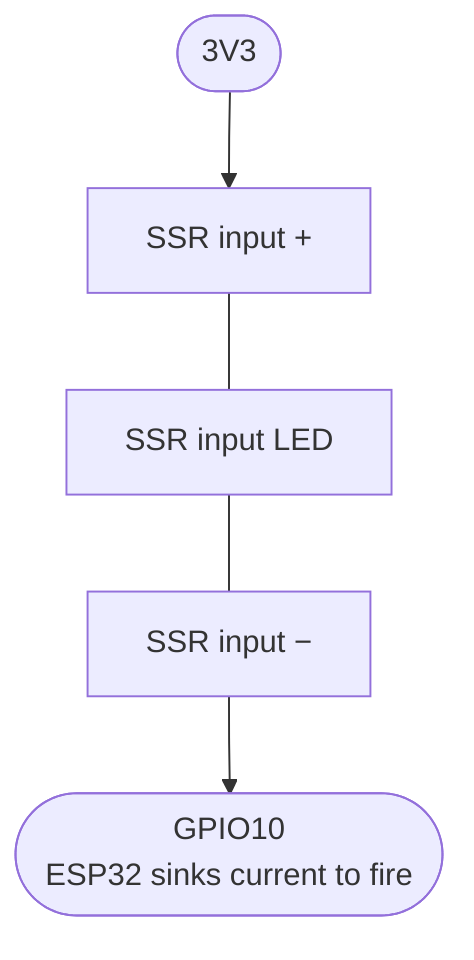
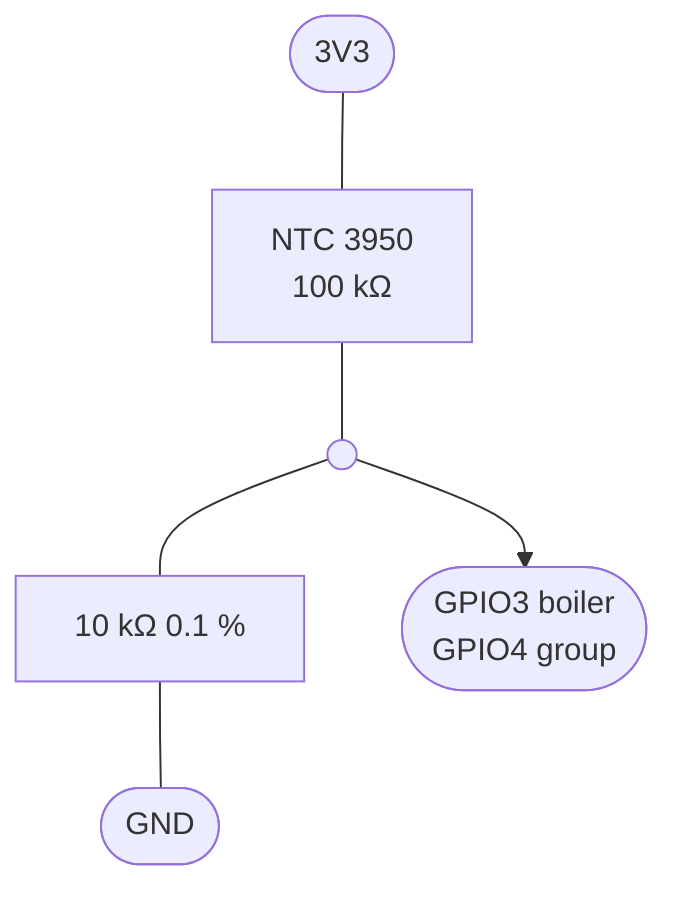
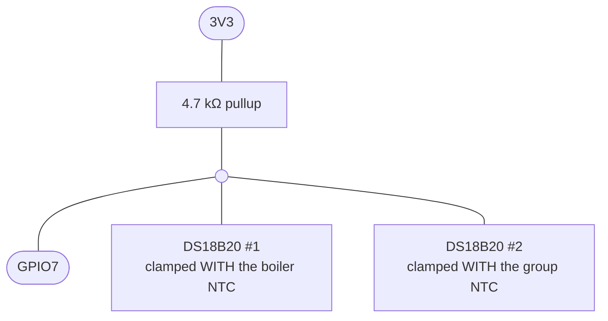

# Hardware, wiring and safety

> **Mains voltage kills.** The Lelit Anita runs on 230 V. Unplug the machine
> and verify with a meter before opening it. If you are not comfortable with
> mains wiring, stop here.

## Bill of materials

| Part | Notes |
|---|---|
| ESP32-C3 0.42" OLED board | "01Space ESP32-C3-0.42LCD" style, 72×40 SSD1306 |
| 2× NTC 3950, 100 kΩ @ 25 °C | ring-lug or clamp style, silicone leads |
| 2× 10 kΩ 0.1 % resistors | divider low side |
| Zero-crossing SSR | ≥10 A @ 230 V, 3–32 V DC input, 10 ms half-wave capable |
| 3.3 V PSU for the ESP32 | or USB supply; must be isolated from mains |

## Machine integration (Lelit Anita PL042)

- The SSR contacts replace **only the brew thermostat** in the element feed.
- The **steam thermostat and the overtemperature safety thermostat stay
  wired in series** with the element, exactly as the factory wired them. They
  are the hardware failsafe; this controller sits behind them, never instead
  of them.
- Boiler NTC: clamped flat to the brass boiler shell with thermal paste and a
  spring clip / hose clamp. Pick a spot away from the element terminals.
- Group NTC: clamped to the group casting with thermal paste. **Document your
  spot and never move it** — the learned offset and the effective ΔT gain are
  specific to the mounting position.

## SSR drive — active-low current sinking

The GPIO **sinks** the SSR input from 3.3 V:

- output LOW → SSR fires
- output HIGH → off
- pin floating / Hi-Z (reset, flashing, bootloader, crash) → off

All failure states are inherently safe with **no external resistor**.
Firmware parks the pin HIGH before `pinMode()` in `SsrOutput::begin()`, and
every fault path lands in `forceOff()`.

Note: holding the button (GPIO9) through a reset enters the ROM bootloader.
The heater stays off (pin floats high-Z), but the machine stops regulating
until power-cycled.

## NTC dividers — high-side topology

Node voltage *rises* with temperature:

| Condition | Node voltage |
|---|---|
| 25 °C | ~0.30 V |
| 95 °C | ~1.83 V |
| NTC open | ~0 V → `NtcOpen` fault |
| NTC shorted | ~3.3 V → `NtcShort` fault |

The whole cold-to-brew span stays inside the ESP32-C3 ADC's well-calibrated
0.1–2.5 V region (11 dB attenuation), fault states are unambiguous, and NTC
self-heating is negligible (<0.3 mW into brass).

**ADC1 only:** GPIO0–4. ADC2 is unusable while WiFi is active on the C3 —
that is why the NTCs sit on GPIO3/GPIO4.

## Optional: DS18B20 reference pair for the calibration run

For the one-time per-NTC curve calibration (observer firmware,
[tuning-hardware.md](tuning-hardware.md) step 0), two DS18B20s share a
1-Wire bus on GPIO7:

- Each probe must be clamped **touching its NTC** — co-location is what makes
  the comparison valid; the boiler shell has gradients of several °C.
- Buy from a reputable source: counterfeit DS18B20s are common and drift
  above 85 °C. The calibration tool cross-checks the two probes against each
  other at cold start and refuses to fit if they disagree by >0.5 °C.
- The probes and the bus are removed again after the run — the control
  firmware has no 1-Wire code.

## Pin map

| Signal | GPIO | Note |
|---|---|---|
| OLED SDA | 5 | board-fixed |
| OLED SCL | 6 | board-fixed |
| Button | 9 | boot button, active low, internal pullup |
| Boiler NTC | 3 | ADC1_CH3 |
| Group NTC | 4 | ADC1_CH4 |
| SSR | 10 | active-low sink, see above |

## Firmware safety layers

1. **Hardware**: factory safety thermostat + thermal fuse in series (never
   removed); active-low SSR drive (all MCU failure modes = heater off).
2. **SafetyMonitor** (latching, SSR forced off, shown on OLED + MQTT):
   overtemp >105 °C, NTC open/short on either channel, stale ADC (>2 s),
   no-rise implausibility (≥50 % average duty for 60 s with <1 °C rise while
   far below setpoint — catches an NTC fallen off the boiler or a stuck SSR).
3. **Task watchdog** on the control task (10 s).
4. Boost ceiling: the boiler setpoint can never exceed 101 °C.

## Bring-up order (do not skip)

1. **Bench, no mains**: flash, verify both NTC channels against ice water
   (~0 °C) and boiling water (~100 °C). Wire an LED (active-low) on GPIO10
   and check the COT-PFM pulse trains at 5/10/25/50 % duty; confirm the LED
   stays OFF through a full reset/flash cycle.
2. **Fault drills**: unplug each NTC → fault on OLED, SSR pin off. Short each
   → same.
3. **First power-on in the machine**: temporarily cap the duty (set
   `uMax = 0.3f` in `config`/`AdrcParams`) and watch the first full heat-up
   with `tools/plot_serial.py`. Keep a hand on the plug.
4. **Calibration**: at steady 95 °C compare against a trusted thermometer and
   set `NtcConfig::offsetC` per channel (one-point calibration — the C3 ADC
   plus resistor tolerances are good for ±1–2 % absolute, not better).
5. Full duty, tuning per [adrc.md](adrc.md).
