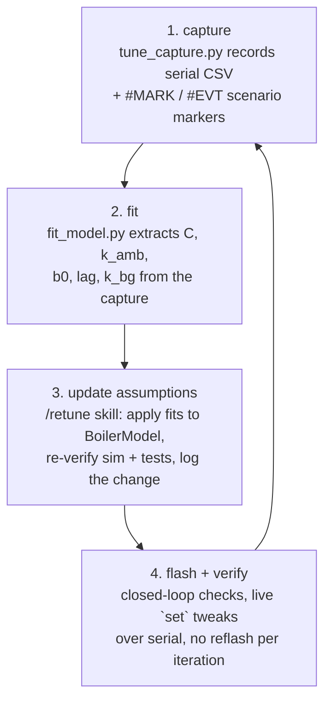

# Hardware tuning playbook

> **Prefer the wizard.** In Claude Code, run **`/tune-wizard`** — it walks
> you through every scenario below at the machine, runs and validates all
> captures itself, and finishes with the retune (pausing before flash). This
> document is the reference for what the wizard does and for manual runs.

The controller defaults were derived from the simulated boiler model
([adrc.md](adrc.md)). This playbook makes the model match *your* machine:



Everything runs over the USB cable — MQTT/HA is not needed for tuning.

## The serial console

The firmware accepts newline commands on the same port that streams the CSV:

| Command | Effect |
|---|---|
| `id duty 0.4 120` | hold 40 % duty for 120 s, then auto-revert to regulation |
| `id off 300` | heater off for 300 s (cool-down segment) |
| `id stop` | abort the experiment |
| `mark espresso` | writes `#MARK <millis> espresso` into the stream |
| `set b0\|wc\|wo\|pred\|kboost\|cap\|setpoint <v>` | live tuning, bounds-checked |
| `get` | dumps `#PARAMS …` (current values) |

Identification overrides run **with the SafetyMonitor fully armed** — any
fault (overtemp, NTC, no-rise) cancels the experiment and forces the SSR off.
The `NoRise` check judges the *delivered* duty, so a deliberate `id off` or a
`set cap` never false-trips it.

While `tune_capture.py` is recording it also polls a sidecar **control file**
(`<capture>.ctl`, or `--ctl <path>`): every new line appended there is sent
to the device verbatim, and the literal line `STOP` ends the capture. This is
how the `/tune-wizard` skill injects `mark`/`set` commands mid-capture
without a second serial connection:

```
echo "mark espresso" >> captures/20260716-....ctl
echo "STOP"          >> captures/20260716-....ctl
```

Other wizard-facing flags: `--duration <s>` (auto-stop, mandatory for
background runs), `--status-json <path>` (health summary on exit), and
`--replay <log>` (stream an existing log through the identical code path —
CI and dry runs, no hardware). Capture quality is checked per scenario with
`fit_model.py <capture> --validate <scenario>` (JSON verdict + metrics).

## Step by step

### 0. Prerequisites

Bench bring-up done per [hardware.md](hardware.md): NTCs verified in ice and
boiling water, SSR LED test, machine integrated behind the factory safety
thermostat. `pip install -r tools/requirements.txt`.

### 1. Sensor calibration (once)

At steady ~95 °C compare the boiler NTC against a trusted thermometer and put
the difference into `NtcConfig::offsetC` (`src/main.cpp` NtcAdc construction).
Repeat for the group channel. Reflash.

### 2. First power-on, duty-capped

```
python tools/tune_capture.py --port /dev/ttyACM0 --name first_heatup
# in the console:  set cap 0.3
```

Watch the capped heat-up. If anything looks wrong, pull the plug — the
active-low SSR wiring means any MCU failure is heater-off.

### 3. Capture a cold start

Machine cold, then record a full unattended warm-up (cap back at 1.0):

```
python tools/tune_capture.py --port /dev/ttyACM0 --name cold_start
```

### 4. Run the identification recipe

From a fully warmed, idle machine:

```
python tools/tune_capture.py --port /dev/ttyACM0 --name ident --recipe id
```

The recipe waits 120 s for a clean steady window, cools 7 min, steps to 40 %
for 2 min, cools again — all inside the safety envelope. This is the same
sequence the CI round-trip validates against the simulator.

### 5. Fit and update the model

```
python tools/fit_model.py captures/<date>-ident.log
```

Then run **`/retune`** in Claude Code (see `.claude/skills/retune`) — it
applies the fitted constants to `BoilerModelParams`/`AdrcParams`, re-runs the
simulator scenarios and the regression tests, re-tunes ωc/ωo/predS in sim if
the contract broke, appends a tuning-log entry, and rebuilds the firmware.
Review the diff, flash.

### 6. Closed-loop verification on the machine

Record everything; label events as they happen (`m <text>` in the capture
terminal):

1. Setpoint step: `set setpoint 90`, wait, `set setpoint 93` — overshoot
   should stay <1 °C. Oscillation → lower `wc` 30 % (`set wc …`), sluggish →
   raise until the first overshoot, back off 30 %.
2. `b0` sanity: slow duty oscillation around the setpoint → `b0` too small;
   large drifting z2 with sluggish response → too big. The fit report's
   z2 cross-check is usually the best value.
3. Pull a blank single shot (`m espresso` first): group dip should recover to
   ±0.5 °C within a minute; check the draw got detected (`draw` column).
4. Warm-up boost: from cold, time-to-ready with `set kboost 0` vs 2.0 vs 3.0.
   Higher = faster warm-up, more group overshoot when the boost decays.
5. Big draw (two cups, `m bigdraw`): duty must pin at 100 % within ~15 s;
   after refill/recovery no fault, no windup.

Every accepted change: bake into `config.h`/`CoreConfig` defaults, run
`pio test -e native`, entry in [tuning-log.md](tuning-log.md), commit.

## What the fits mean

| Fitted | Feeds | Note |
|---|---|---|
| `C_total` | `cWater+cBrass`, `b0 = P/C` | cooling + step estimates should agree within ~20 % |
| `k_lumped` | `kAmbB` (minus `k_ambG`) | sets the idle duty the sim predicts |
| `lag` | bound `wc ≲ 1/(2·lag)`, `predS ≈ 2·lag` | clamp quality dominates this |
| `k_bg`, `k_ambG` | group coupling in the sim | assumes `Cg` (500 J/K default, `--cg`) |
| `group_offset_ss` | sanity check on learned `offset_ss` | NVS value should converge here |

The point of updating the model (not just the controller): once the sim
matches the machine, every future controller experiment can run in
`pio test -e native` first — and the CI regression contract keeps meaning
something about *your* espresso machine, not a paper one.
